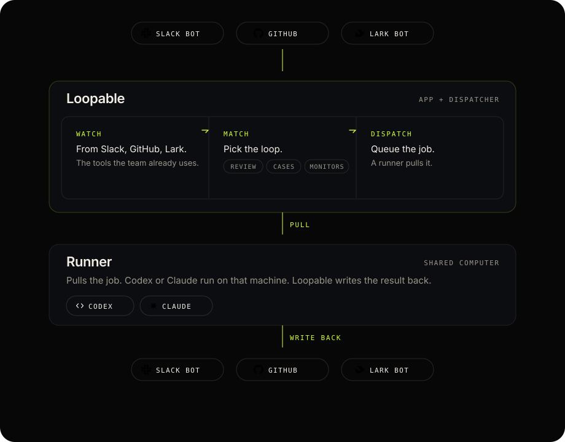

# Loopable

Loopable is the team’s always-on agent for shared-knowledge work — review, cases, monitors. A lot of work should not depend on one person. People assign work in Slack, GitHub, and on a schedule. Codex and Claude finish it on a shared computer.

It picks up a signal, does what the loop says, and writes the result back. Loops run on their own. Every run is recorded in the inbox.

Connect GitHub, a Slack bot, a Feishu / Lark bot, Gmail, or WeChat. Write a loop. Leave the machine on. Pull requests get reviewed, assigned issues get a draft, a scheduled job runs at 9am. The team does not have to open Codex.

The story is in [docs/narrative.md](docs/narrative.md). The words for the parts — loop, workflow, runner, and the rest — are in [docs/concepts.md](docs/concepts.md).

## Architecture

Three processes. The agent always runs on a Runner, never on the App or Dispatcher.

<p align="center">
  
</p>

Slack bot, GitHub, and Lark bot send work in. Loopable watches, matches a loop, and queues the job. A Runner pulls it, runs Codex or Claude, and Loopable writes the result back.

```text
Loopable  ──HTTP pull──  Runner  ──  Agent CLI
(App + Dispatcher)
```

| Process | Does |
| --- | --- |
| **App** | UI, HTTP API, OAuth, the interface runners pull from |
| **Dispatcher** | Watches for signals, matches loops, queues jobs, writes back |
| **Runner** | Pulls a job over HTTP, runs the agent CLI |

App and Dispatcher share one database and stay on the same host. Only one Dispatcher may run against that database. Runners join over HTTP from that host or other machines. Extra runners are in [docs/deploy.md](docs/deploy.md).

## Run it

The usual setup is one computer that stays on — a Mac in the office is enough. App, Dispatcher, and a Runner all live there. It looks like a spare machine on a desk. For a small team, that is the product.

You need Node 22+ and an agent CLI signed in on that machine (Codex or Cursor Agent / Claude).

```bash
npm install -g loopable-cli
loopable start                # App + Dispatcher, bound on all interfaces
```

On the same computer, open `http://127.0.0.1:4321`. Connect GitHub from that address. Write a loop. On Runners, copy the join command and start a runner (this machine is fine):

```bash
loopable runner --url http://<LAN-IP>:4321 --token <from Runners>
```

If the dispatcher is not running, the app says so. If no runner has joined, tasks wait.

State lives in `~/.loopable/`. Credentials stay in the OS keychain.

Another always-on runner, or opening the UI from a second computer, is in [docs/deploy.md](docs/deploy.md). A company VM is optional later, only if this box is not enough.

## Develop

This section is only for working on the code. Running Loopable as a product is the CLI above, not pnpm. Dev uses `~/.loopable-dev/` and a separate keychain namespace, so it does not touch the team database.

TanStack Start (React + Vite), SQLite, Tailwind. Tests are Vitest.

```bash
pnpm install
pnpm dev            # App + Dispatcher + Runner, ~/.loopable-dev, hot reload
pnpm typecheck
pnpm test
pnpm db:generate    # after changing src/server/db/schema.ts
pnpm db:studio
```

`pnpm runner` is only for a second machine while `pnpm dev` is already running.

The public site is `site/` (static HTML, Vite). `pnpm site:dev` to preview. `pnpm site:build` writes `site/dist` for a Cloudflare Worker with assets only. `pnpm site:deploy` when you are ready to publish it.

| Path | Contents |
| --- | --- |
| `src/connectors/` | One folder per connector: `manifest.ts` (browser-safe) and `runtime.ts` (server) |
| `src/agents/` | One folder per agent, same split |
| `src/server/` | Database, secrets, queue, server functions |
| `src/dispatcher/` | Dispatcher process |
| `src/runner/` | Runner process |
| `src/routes/` | Pages and `/api/` |
| `drizzle/` | Migrations |

A new connector is a folder plus one line in `src/connectors/manifests.ts` and `src/connectors/runtimes.ts`. See [docs/connectors.md](docs/connectors.md).
